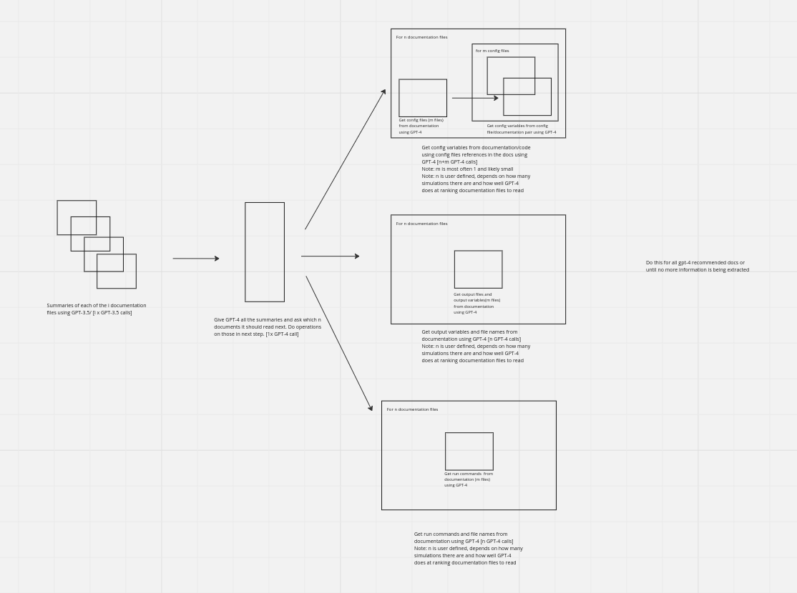

# Auto-Config
This repository contains code to extract configuration files and parameters, output files and parameters and run commands from a code repository and associated documentation.
The auto config extraction pipeline uses llms to do this extraction.
A diagram of the overall system is below.



The code for the extraction pipeline is in extract/main.py under the function integrated_pipeline.
This file also contains other experiments and works in progress for improving the robustness of the pipeline to the state of the documentation/code..

A video explaining the extraction pipeline using MITGCM as an example is below -

[Demo Video](https://www.youtube.com/watch?v=LLY966_iytg)


## Getting Started
```
conda create -n auto-config python=3.10
conda activate auto-config
pip install -r requirements.txt
```

To download the MITGCM repo required for the example use the following commands from this directory
```
git clone https://github.com/MITgcm/MITgcm.git
```

You should now be run the demo pipeline using the following:

```
python extract/main.py
```

## Download
